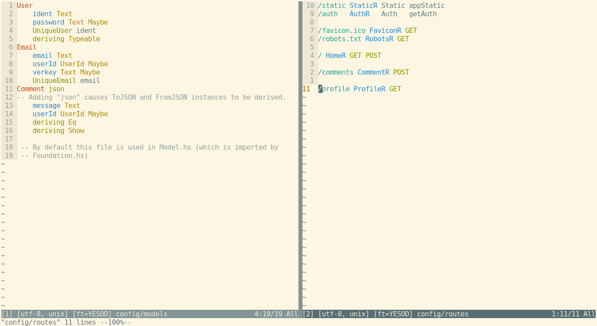

# Yesod.vim

Vim plugin for the Haskell [Yesod web framework](http://www.yesodweb.com/).


* Syntax for `config/models`
* Syntax for `config/routes`
* Syntax for i18n `messages/`
* Jump between widget `Hamlet`, `Julius`, `Lucius` and `Cassius` files
* Jump to handler files from declared routes
* Jump to and Create i18n messages
* Jump to `routes` and `models` files
* Create new handlers for routes under the cursor while in `config/routes`
* Touch files with altered TH and Static resources dependencies

**Note:** This plugin *does not* add syntax for *shakesperean templates*, there
is another plugin that does:
[vim-syntax-shakespeare](https://github.com/pbrisbin/vim-syntax-shakespeare).


## Installation

Compatible with `Vundle`, `Pathogen`, `Vim-plug`.


## Usage

*yesod.vim* gives you some predefined mappings:

Map | Command | Action
--- | ------- | ------
**gh** | :YesodOpenHandler | Jump to the handler of the route under the cursor
**gH** | :YesodAddHandler | Create a new handler for the route under the cursor
**gm** | :YesodOpenMessage | Jump to or create the i18n message under the cursor
**ghh** | :YesodOpenHamlet | Open the current widget Hamlet file
**ghj** | :YesodOpenJulius | Open the current widget Julius file
**ghl** | :YesodOpenLucius | Open the current widget Lucius file
**ghc** | :YesodOpenCassius | Open the current widget Cassius file
**ghT** | :YesodTouch | Touch modified TH and Static resources files
**gym** | :YesodOpenModels | Open models file
**gyr** | :YesodOpenRoutes | Open routes file


### Open Handler `gh`

Will jump to the first handler found and fill the location list with each http
method available for that handler, so you can jump between them with `:lnext`
and `:lprev`.

*Note*: If your using a `Vim version <= 7.4.1800`, the quickfix list will be
used instead (because of a nasty bug in Vim before that version), in which case
you use `:cnext` and `:cprev`.

### Create Handler `gH`

This will use `yesod-bin` so be sure you have it installed.

If your project directory structure is not the scaffolding default, this may not
work!

### Open i18n Message `gm`

It will always take you to the message for the default language.

### Open Hamlet `ghh`, Julius `ghj`, Lucius `ghl` and Cassius `ghc` files

While in a `hamlet`, `julius`, `lucius` or `cassius` file you can use any of
those commands or default mappings to easily jump to the corresponding file.

### Touch files `ghT`

Whenever you add a new static file (like an image) to `static/` or modify a file
that depends on template Haskell generation use `ghT` to touch those, so they
are re-built.


## Configuration

### Mappings

You can disable the predefined mappings with:

```vim
let g:yesod_disable_maps = 1
```

And then add your own like:

```vim
nnoremap <leader>H :YesodAddHandler<CR>
nnoremap <leader>h :YesodOpenHandler<CR>
nnoremap <leader>m :YesodOpenMessage<CR>

nnoremap <leader>wh :YesodOpenHamlet<CR>
nnoremap <leader>wj :YesodOpenJulius<CR>
nnoremap <leader>wl :YesodOpenLucius<CR>
nnoremap <leader>wc :YesodOpenCassius<CR>

nnoremap <leader>T :YesodTouch<CR>

nnoremap <leader>M :YesodOpenModels<CR>
nnoremap <leader>R :YesodOpenRoutes<CR>
```

### Handlers

The Yesod default location for handlers is `Handler` in the project root. If you
keep your handlers in more than one directory, lets say for instance:
`src/` and `moreHandlers/`, you can configure it like:

```vim
let g:yesod_handlers_directories = ['Handler', 'src', 'moreHandlers']
```

The Handlers directories you define will be searched recursively.

### i18n Messages

Default i18n language to use:

```vim
let g:yesod_messages_default_lang = "en"
```

Messages directory:

```vim
let g:yesod_messages_path = "messages"
```


## Screenshots

`config/models` and `config/routes` files:


